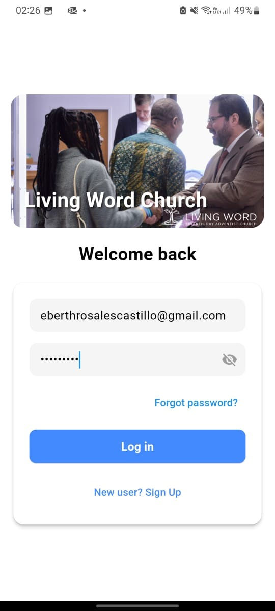
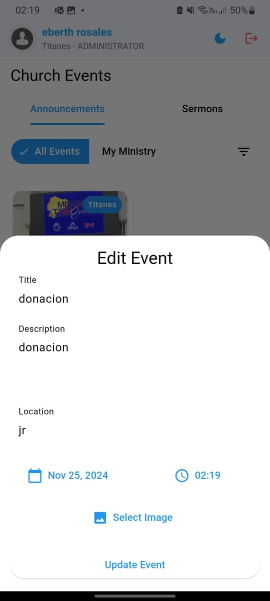
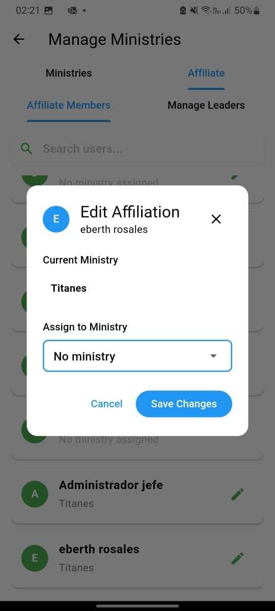

# Living Word Seventh Day Adventist Church App


**Living Word App** es una aplicación móvil desarrollada en **Flutter** con un backend basado en **Spring Boot**, diseñada para facilitar la interacción y gestión de las actividades de la iglesia *Living Word Seventh Day Adventist Church*. 

La aplicación integra servicios modernos como notificaciones push y envíos de correos electrónicos, proporcionando una experiencia completa para los usuarios.

---

## Características principales

### Frontend (Flutter)


- **Interfaz moderna y responsiva**: Diseñada para una experiencia de usuario intuitiva y amigable.
- **Modo día/noche**: Compatible con preferencias de visualización.
- **Sincronización en tiempo real**: Utilizando Firebase para mantener la información actualizada.
- **Soporte para imágenes y documentos**: Funcionalidades para gestionar eventos, anuncios y encuestas.

### Backend (Spring Boot)


- **API RESTful**: Gestión de usuarios, eventos, encuestas y más.
- **Autenticación segura**: Basada en tokens para proteger los datos de los usuarios.
- **Correo electrónico con SMTP**: Para el registro y la verificación de cuentas de usuario.
- **Estructura modular**: Escalable y fácil de mantener.

### Servicios integrados


- **Firebase**:
  - Notificaciones push para alertas y actualizaciones importantes.
  - Almacenamiento en la nube para recursos multimedia.
- **SMTP**:
  - Envío de correos electrónicos de verificación y notificaciones.

---

## Instalación

### Requisitos previos
1. Tener instalado:
   - [Flutter SDK](https://flutter.dev/docs/get-started/install) (versión recomendada: 3.0 o superior).
   - [Java JDK](https://www.oracle.com/java/technologies/javase-jdk11-downloads.html) (versión 11 o superior).
   - [Spring Boot CLI](https://spring.io/guides/gs/spring-boot/).
2. Acceso a una cuenta Firebase configurada para este proyecto.

### Configuración inicial
1. Clonar este repositorio:
   ```bash
   git clone https://github.com/tu_usuario/living-word-app.git
   cd living-word-app
2. Configurar Firebase:
   - Descargar el archivo `google-services.json` (para Android) y/o `GoogleService-Info.plist` (para iOS) desde Firebase Console.
   - Ubicar los archivos en sus respectivos directorios (`android/app` y `ios/Runner`).
3. Configurar el backend:
   - Ajustar el archivo `application.properties` en el backend con:
     - Credenciales SMTP para envío de correos.
     - URL y credenciales de la base de datos.
     - Claves y configuraciones de Firebase.
4. Ejecutar los servicios:
   - **Backend**:
     ```bash
     ./mvnw spring-boot:run
     ```
   - **Frontend**:
     ```bash
     flutter pub get
     flutter run
     ```

---

## Uso

1. Los usuarios pueden registrarse ingresando su correo electrónico. Recibirán un correo de verificación antes de acceder a la app.
2. Acceso a funcionalidades como:
   - Eventos.
   - Encuestas.
   - Anuncios de la iglesia.
   - Notificaciones push personalizadas.

---

## Imágenes de la App

A continuación, se presentan capturas de pantalla de la aplicación funcionando:

### Vista de Inicio


### Vista de Eventos


### Vista de Estadísticas



## Tecnologías utilizadas

### Frontend
- **Flutter (Dart)**.
- Plugins destacados:
  - `firebase_messaging` para notificaciones push.
  - `http` para conexiones API.

### Backend
- **Spring Boot**.
- Librerías:
  - `JavaMailSender` para SMTP.
  - `Spring Security` para autenticación.

### Servicios externos
- **Firebase**:
  - Notificaciones push.
  - Cloud Storage.

---

## Contribución

1. Haz un fork del proyecto.
2. Crea una nueva rama:
   ```bash
   git checkout -b feature/nueva-funcionalidad
3. Realiza tus cambios y haz commit:
   ```bash
   git commit -m "Agregada nueva funcionalidad"
4. Haz push a tu rama y crea un Pull Request.

## Contacto

Para consultas o sugerencias:  
**Living Word Seventh Day Adventist Church**  
**Email**: contacto@livingwordchurch.com  
**Web**: [www.livingwordchurch.com](http://www.livingwordchurch.com)

### Imágenes sugeridas:
- **`livingword_logo.png`**: El logo de la iglesia.
- **`flutter_logo.png`**: Logo oficial de Flutter.
- **`springboot_logo.png`**: Logo oficial de Spring Boot.
- **`firebase_logo.png`**: Logo oficial de Firebase.
- **`app_screenshot.png`**: Una captura de pantalla de la app en funcionamiento.


